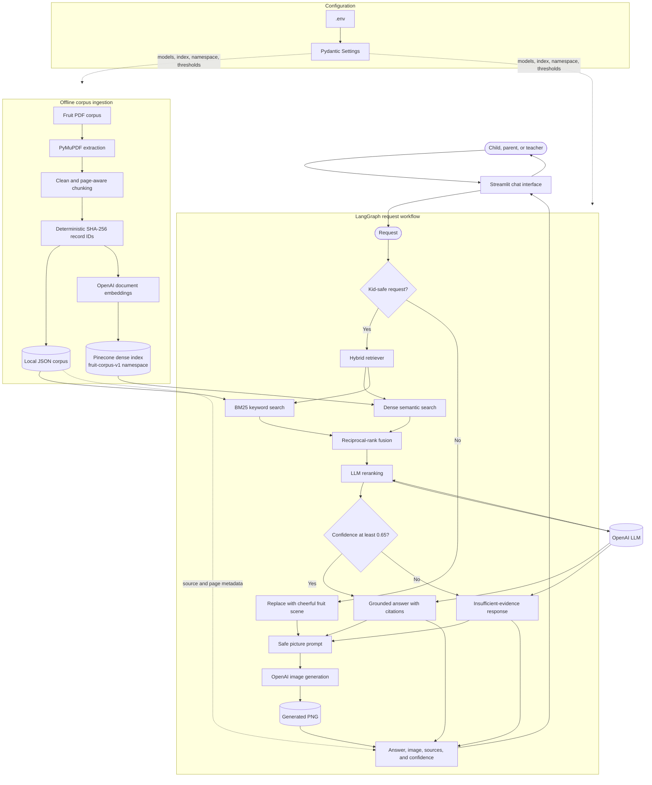
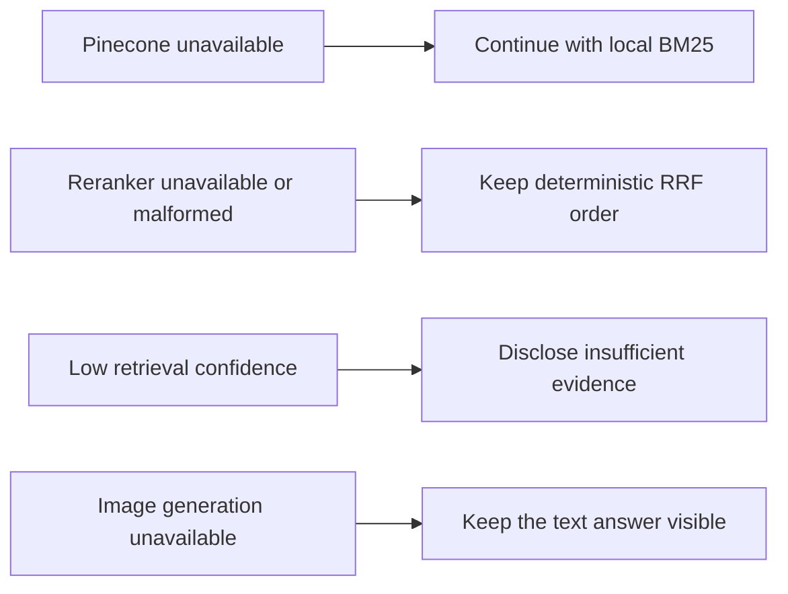

# Fruity Fun Architecture

## Main execution paths

- **Ingestion:** `scripts/ingest.py` extracts PDFs, creates deterministic chunks, writes the local JSON corpus, generates embeddings, and upserts records into Pinecone.
- **Retrieval:** `HybridRetriever` queries Pinecone and BM25, combines their rankings with RRF, and calculates evidence confidence after reranking.
- **Orchestration:** `FruityFunAgent` uses LangGraph to move each request through safety, retrieval, reranking, answer composition, and image generation.
- **Presentation:** `app.py` keeps chat history and displays the answer, generated picture, citations, retrieval channels, and confidence.

## Failure behavior

